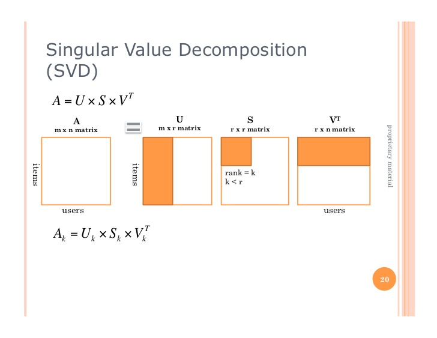

# Collaborative_filtering

 This repository demonstrates the usage of Collaborative Filtering (CF) on a dataset of ratings for musical instrument (source: http://jmcauley.ucsd.edu/data/amazon/)
The dataset contains 4 columns, user, item, rating, timestamp. 

The python notebook provides a quick comparison of algorithms for <i> Memory based CF</i>, <i>Model based CF (rank factorization via SVD)</i>, as well as <i>Stochastic Gradient Descent</i> for solving the rank factorization.
The script is based on the algorithms presented on these two blogs: http://online.cambridgecoding.com/notebooks/mhaller/implementing-your-own-recommender-systems-in-python-using-stochastic-gradient-descent-4, 
http://blog.ethanrosenthal.com/2015/11/02/intro-to-collaborative-filtering/, but some details were modified to accomodate the dataset and streamline the process. 

<b>Memory based CF  </b>

In Collaborative Filtering. Memory based CF algorithm look for similarity between users or between items. In user-user filter, cosine similarity is calculated between every pair of users within the data set result in a similarity matrix that's n_users X n_users. Similary for item-item, the cosine similarity is calculated between items. 
The similiarity matrix is the weight that will yield model prediction. 

<b>Model based CF (SVD) </b>

Memory based CF algorithm can be very computationally expensive and is known to have issue with scalability, plus it doesn't learn well with highly sparse matrix like the one used in this python example.
A useful alternative is model based CF using SVD for matrix decomposition. This method breaks down the user-item matrix into small matrices with latent-feature vectors,
represent implicit characteristics for the user and items. However, SVD can also become computationally expensive with large matrix. 

  Source: DKAlab (Sldieshare)

<b>Model based CF (Stochastic Gradient Descend) </b>

Another way to solve the matrix factorization is using Stochastic Gradient Descend(SFD) to estimate the low-rank matrices. This method will save on memory thus more computationally efficient because it incrementally updates the model to find a better fit that minimizes the regularized squared error loss function.

  Source: databricks training

After comparing the three algorithm, SGD matrix factorization yielded the best result with 80 iteration to calculate the optimal latent feature matrices. It would be interesting to use the same data set and run it with Alternative Least Squre (ALS) on Spark since it comes with the current Spark ML package. 

